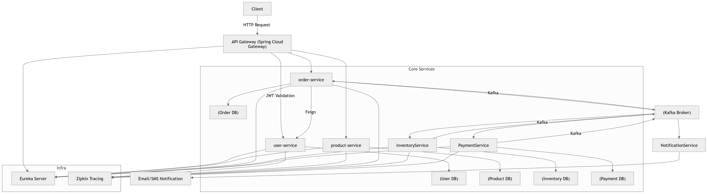
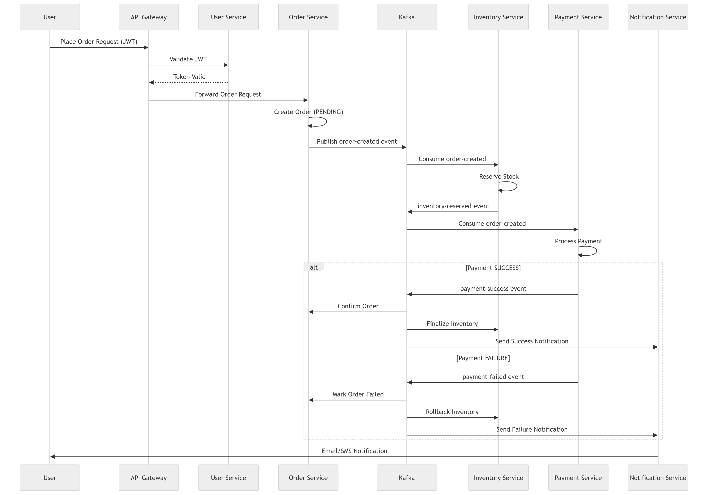
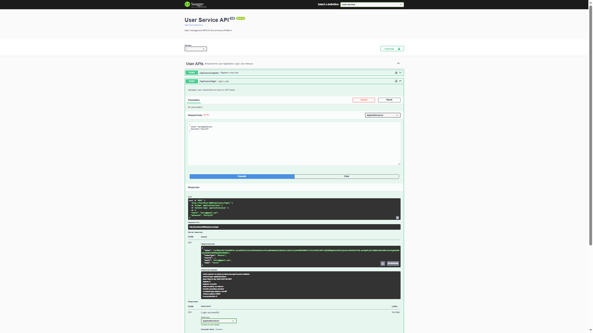
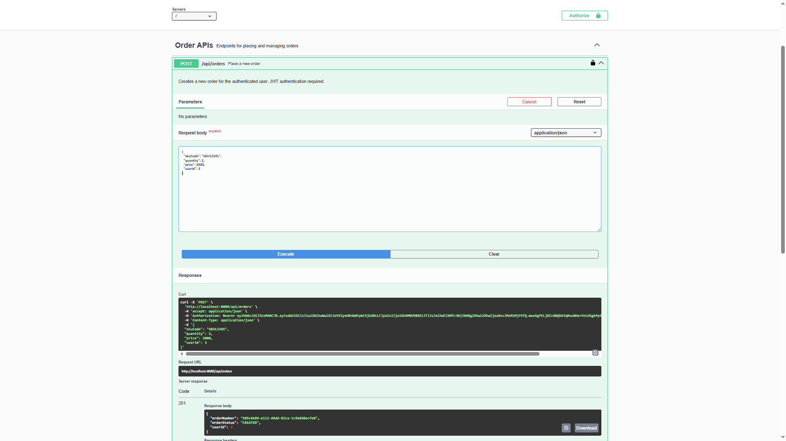

# 📦 E-Commerce Microservices Platform

A **production-grade, scalable e-commerce backend system** built using **Java, Spring Boot, Spring Cloud, Kafka, and Docker**.

This project demonstrates a **real-world microservices architecture** with:

* Event-driven communication (Kafka)
* Distributed transactions using **Saga Pattern**
* Cloud-native design principles
* Fully containerized deployment

---

## 🚀 Key Highlights

* Microservices architecture (Domain-Driven Design)
* Event-driven system using Apache Kafka
* API Gateway with JWT authentication
* Service discovery using Eureka
* Distributed tracing using Zipkin
* Database-per-service (MySQL)
* Fully containerized using Docker & Docker Compose
* Fault-tolerant order workflow using Saga (compensation-based rollback)

---

## 🎯 Why This Project?

This project was built to simulate a **real-world scalable backend system** and to demonstrate:

* Handling **distributed transactions** using Saga pattern
* Designing **event-driven systems** with Kafka
* Building **loosely coupled microservices**
* Implementing **observability and tracing** in distributed systems

---

## 🏗️ Architecture

### 🖼️ High-Level Architecture



### 🔍 Architecture Explanation

- Client sends requests via API Gateway
- API Gateway routes traffic to microservices
- Eureka Server handles service discovery
- Order Service orchestrates the workflow
- Kafka enables asynchronous communication
- Payment, Inventory, and Notification services consume events

---

## 🔄 Saga Workflow (Sequence Diagram)



### 🔍 Workflow Explanation

1. User places order via API Gateway
2. JWT is validated by User Service
3. Order Service creates order (PENDING)
4. Order Service publishes `order-created` event to Kafka
5. Inventory Service reserves stock
6. Payment Service processes payment

### ✅ Success Flow
- Payment success event triggered
- Order marked as COMPLETED
- Notification sent to user

### ❌ Failure Flow
- Payment failure event triggered
- Inventory rollback executed
- Order marked as FAILED
- Failure notification sent

---

## 🔧 Core Services
🧩 Service Responsibilities

- 🚪 **API Gateway**  
  Acts as the entry point for all client requests, handles routing, and performs JWT validation  

- 👤 **User Service**  
  Manages user authentication, user data, and JWT generation  

- 🛍️ **Product Service**  
  Handles product catalog and related data management  

- 📦 **Order Service**  
  Responsible for order creation and Saga orchestration across services  

- 📊 **Inventory Service**  
  Manages stock reservation and rollback mechanisms  

- 💳 **Payment Service**  
  Processes payments and manages transaction status  

- 🔔 **Notification Service**  
  Sends email and SMS notifications for order-related events  

- 🌐 **Eureka Server**  
  Provides service discovery and registry for all microservices                        

---

## 🔐 Security

* JWT-based authentication
* Token validation at API Gateway
* Stateless authentication model
* Secure inter-service communication

---

## 🔗 Communication Model

### 🔄 Synchronous Communication (REST / Feign)

Used for:

* User validation
* Product queries
* Direct service-to-service calls

### 📩 Asynchronous Communication (Kafka)

Used for:

* Order processing
* Payment events
* Inventory updates
* Notifications

---

## 📩 Kafka Topics & Event Flow

| Topic Name      | Producer          | Consumer(s)         |
| --------------- | ----------------- | ------------------- |
| order-created   | Order Service     | Payment, Inventory  |
| payment-success | Payment Service   | Order, Notification |
| payment-failed  | Payment Service   | Order               |
| stock-reserved  | Inventory Service | Order               |
| stock-failed    | Inventory Service | Order               |

---

## 🔄 Saga Workflow (Order Processing)

1. Order Service creates order with **PENDING** state
2. Publishes `order-created` event
3. Payment Service processes payment:

   * ✅ Success → emits `payment-success`
   * ❌ Failure → emits `payment-failed`
4. Inventory Service reserves stock:

   * ✅ Success → emits `stock-reserved`
   * ❌ Failure → emits `stock-failed`
5. On failure → **compensation actions triggered**:

   * Refund payment
   * Release reserved stock
6. Final state updated as **COMPLETED or FAILED**

---

## 📈 Observability

* Distributed tracing using **Zipkin**
* Tracks request flow across microservices
* Helps debug latency and failures

---

## 🐳 Deployment

### ⚙️ Prerequisites

* Java 17
* Docker & Docker Compose
* Maven

---

### ▶️ Setup & Run Instructions

1. Clone all service repositories
2. Setup environment variables:

```bash
cp .env.example .env
```

3. Start all services:

```bash
docker-compose up --build
```

4. Access API Gateway:

```
http://localhost:8080
```

---

## 📡 API Documentation

Each service exposes Swagger UI:

| Service              | URL                                         |
| -------------------- | ------------------------------------------- |
| API Gateway          | http://localhost:8080/swagger-ui/index.html |
| User Service         | http://localhost:8086/swagger-ui/index.html |
| Product Service      | http://localhost:8085/swagger-ui/index.html |
| Order Service        | http://localhost:8083/swagger-ui/index.html |
| Payment Service      | http://localhost:8084/swagger-ui/index.html |
| Inventory Service    | http://localhost:8081/swagger-ui/index.html |

---

📬 Postman Collections (API Testing)

All microservices APIs are available as Postman collections for easy testing.

📂 Location
/postman
📥 How to Use
Open Postman
Click Import
Select collection files from /postman folder
Import environment file (if available)
Update base_url if needed
Start testing APIs

📦 Available Collections
Auth Service → auth-service.json
User Service → user-service.json
Product Service → product-service.json
Order Service → order-service.json
Payment Service → payment-service.json
Inventory Service → inventory-service.json

⚙️ Environment Variables

Example:

base_url = http://localhost:8080
token = <your-jwt-token>

Each service is tested independently and follows REST standards.

## 🧪 Sample Workflow

```
User → API Gateway → Order Service → Kafka → Payment + Inventory → Notification → User
```

---

## 📥 Sample API Request

### Create Order

```http
POST /api/orders
```

```json
{
  "userId": 1,
  "skuCode": IP14-128GB-BLK,
  "quantity": 2,
  "price":1499.98
}
```

---

## 📸 API Documentation

### Swagger UI Overview


### Create Order Endpoint



---

📦 **Core Services Repositories**

- 👤 **User Service**  
  Handles user authentication, registration, and JWT management  
  🔗 [GitHub Repository](https://github.com/arti-ch278/E-commerce-microservice-user-service)

- 🛍️ **Product Service**  
  Manages product catalog and inventory  
  🔗 [GitHub Repository](https://github.com/arti-ch278/E-commerce-microservice-product-service)

- 📦 **Order Service**  
  Handles order creation and Saga orchestration  
  🔗 [GitHub Repository](https://github.com/arti-ch278/E-commerce-microservice-order-service)

- 💳 **Payment Service**  
  Manages payment processing and status tracking  
  🔗 [GitHub Repository](https://github.com/arti-ch278/E-commerce-microservice-payment-service)

- 📊 **Inventory Service**  
  Handles stock management and reservation  
  🔗 [GitHub Repository](https://github.com/arti-ch278/E-commerce-microservice-inventory-service)

- 🔔 **Notification Service**  
  Sends email/SMS notifications for order events  
  🔗 [GitHub Repository](https://github.com/arti-ch278/E-commerce-microservice-notification-service)

- 🚪 **API Gateway**  
  Acts as a central entry point for routing and JWT-based security  
  🔗 [GitHub Repository](https://github.com/arti-ch278/E-commerce-microservice-api-gateway)

- 🌐 **Eureka Server**  
  Provides service discovery and registry for all microservices  
  🔗 [GitHub Repository](https://github.com/arti-ch278/E-commerce-microservice-eureka-server)


🌍 **System-Level Repository**

To run the complete system locally using Docker:

- 🧩 **E-commerce Microservices System**  
  Contains Docker setup, configuration, and system-wide resources  
  🔗 [GitHub Repository](https://github.com/arti-ch278/E-commerce-microservices-system)

**This repository includes:**
- Docker Compose setup  
- Environment configuration  
- Architecture diagrams  
- Postman collections  
- System-wide documentation

---

## 🧰 Tech Stack

* Java 17
* Spring Boot 3.x
* Spring Cloud (Gateway, Eureka, OpenFeign)
* Apache Kafka
* MySQL 8.x
* Docker & Docker Compose
* Zipkin (Distributed Tracing)

---

## 🧠 Key Design Principles

* Loose coupling between services
* Event-driven architecture
* Database per service
* Fault-tolerant distributed workflow
* Horizontal scalability
* Cloud-native design

---

## 🚧 Future Improvements

* Centralized logging (ELK Stack)
* Circuit breaker (Resilience4j)
* Kubernetes deployment
* API rate limiting
* OAuth2 / Keycloak authentication

---

## 👨‍💻 Author

ARTI CHOUREY
Backend Developer (Java | Spring Boot | Microservices)


---
